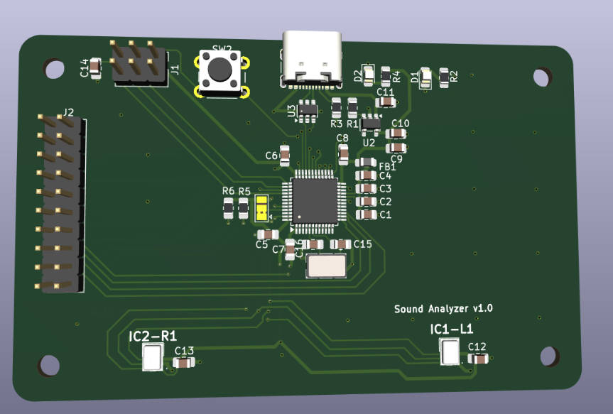
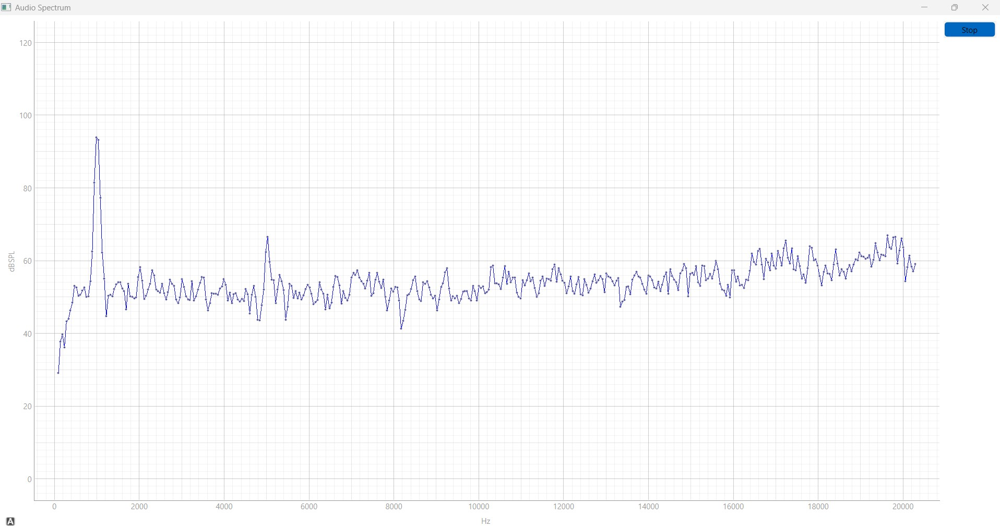

# Sound Analyzer

STM32-powered board for analyzing sound input from MEMS microphones, designed as an open-source, hands-on introduction to DSP on ARM Cortex-M4 processors.



## Table of Contents

1. [About the Project](#about-the-project)
1. [Project Status](#project-status)
1. [Getting Started](#getting-started)
	1. [Getting the Source](#getting-the-source)
	1. [Usage](#usage)
	1. [Versioning](#versioning)
1. [How to get help](#how-to-get-help)
1. [License](#license)

## About the Project

It uses the CMSIS-DSP library to handle computationally intensive tasks, while a companion PyQt-based Python script is used for plotting frequency-domain data data from PCB to host PC. 

The goal is to demonstrate the full pipeline of audio signal acquisition and transformation, from raw time-domain data to frequency-domain analysis

The PCB intentionally exposes additional unused pins, allowing users to extend functionality and experiment beyond the core features

_1kHz sine_


Front                      |  Back
:-------------------------:|:-------------------------:
  |  


**[Back to top](#table-of-contents)**

## Project Status

In progress, working version availabe in `main` branch

Full STM32CubeIDE project is hosted here, with .elf and .bin files ready inside `code/sound_analyzer_v1/Debug` folder

As for python script, both source `plot_graph.py` and executable `plot_graph.exe` are available, with executable tested only for Windows platform

**[Back to top](#table-of-contents)**

## Getting Started

For application usage, no extra programm shall be installed , other than downloading the executable plot_graph.exe

For developer usage, STM32CubeIDE + STM32CubeMX shall be installed, as described [here](https://wiki.st.com/stm32mcu/wiki/STM32StepByStep:Step1_Tools_installation)

In addition, Python >=3.9 shall be installed from [here](https://www.python.org/downloads/), with the following Python libraries also installed :
- Numpy
- PySide6
- pyqtgraph
- Pyserial

PCB files are located on '>dfs'


### Getting the Source

This project is [hosted on GitHub](https://github.com/path321/sound_spectrum_mcu). You can clone this project directly using this command:

```
https://github.com/path321/sound_spectrum_mcu.git
```

### Usage

1) Connect the board via USB to your host PC. Make sure that no other STM32-based USB is connected to PC

2) Double click on plot_graph.exe

3) If you want to stop the live graph, check on the Button on the top right end of the GUI window

### Versioning

This project uses [Semantic Versioning](http://semver.org/). For a list of available versions, see the [repository tag list](https://github.com/path321/sound_spectrum_mcu/tags).

**[Back to top](#table-of-contents)**

## How to Get Help

Please create a new issue on

```https://github.com/path321/sound_spectrum_mcu/issues```

**[Back to top](#table-of-contents)**

## License

This project is licensed under the MIT License - see [LICENSE.md](LICENSE.md) file for details.

**[Back to top](#table-of-contents)**